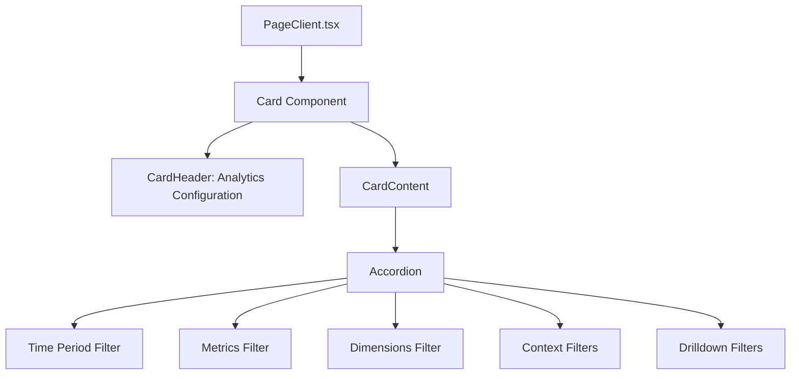
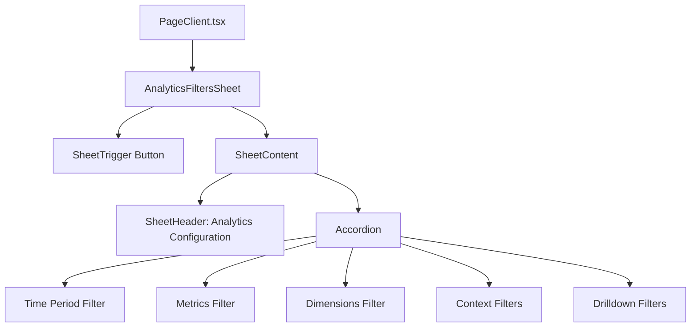
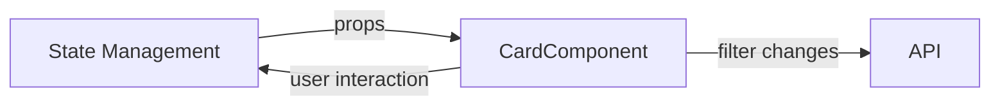
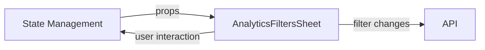
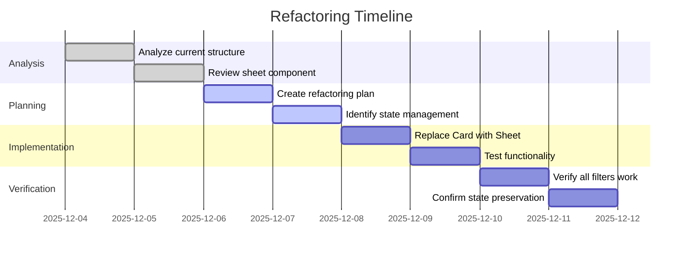

# Analytics Configuration Refactoring - Visual Diagram

## Current Architecture



## Proposed Architecture



## Data Flow Comparison

### Current Data Flow



### New Data Flow



## UI Layout Changes

### Before (Card-based)

```
┌─────────────────────────────────┐
│ Analytics Configuration          │
├─────────────────────────────────┤
│ ▼ Time Period                     │
│ ▼ Metrics                        │
│ ▼ Dimensions                     │
│ ▼ Context Filters                │
│ ▼ Drilldown Filters              │
└─────────────────────────────────┘
```

### After (Sheet-based)

```
[Analytics Filters Button]  ← Click to open sheet

┌─────────────────────────────────┐
│ Analytics Configuration          │
├─────────────────────────────────┤
│ ▼ Time Period                     │
│ ▼ Metrics                        │
│ ▼ Dimensions                     │
│ ▼ Context Filters                │
│ ▼ Drilldown Filters              │
└─────────────────────────────────┘
```

## Implementation Checklist



## Key Benefits

1. **Improved User Experience**: Sheet pattern is more intuitive for filter management
2. **Consistent UI Pattern**: Follows established sheet component design
3. **Preserved Functionality**: All existing logic remains unchanged
4. **Better Space Utilization**: Sheet can be closed when not needed
5. **Mobile-Friendly**: Sheet pattern works better on smaller screens

## Risk Mitigation

- **Low Risk**: Only UI layer changes, core logic remains
- **Backward Compatible**: All existing state management preserved
- **Testable**: Easy to verify all filters work as before
- **Reversible**: Can easily revert to Card-based approach if needed
