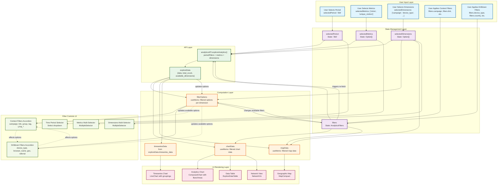
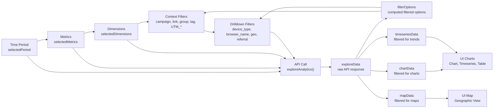
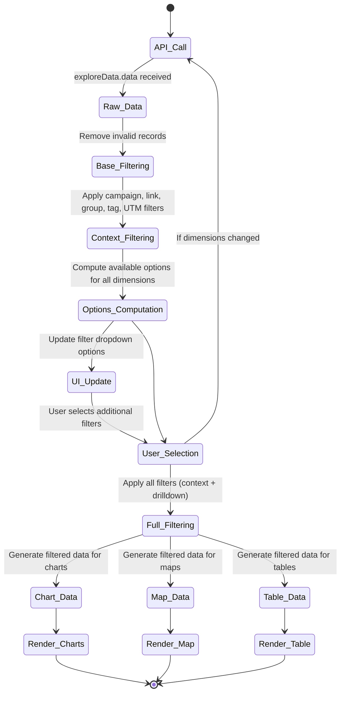
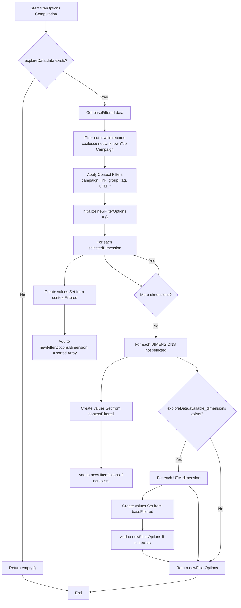

# Analytics Filters Flow: Complete Data Flow and Cross-Filter Relationships

## Overview

This document provides a comprehensive analysis of the analytics filters system in the SmartHhubLink application, showing the complete data flow, filter hierarchies, cross-filter relationships, and dependency loops.

## Filter Hierarchy and Data Flow Architecture

## Detailed Filter Relationships and Cross-Filtering Logic

### 1. Primary Filter Chain (Sequential Dependencies)

### 2. Context Filters Cross-Filtering Matrix

```mermaid
graph TD
    subgraph "Context Filters (Applied First)"
        CAMP["campaign\nfilters.campaign"]
        LINK["link\nfilters.link"]
        GROUP["group\nfilters.group"]
        TAG["tag\nfilters.tag"]
        UTM["UTM Parameters\nfilters.utm_*"]
    end

    subgraph "Drilldown Filters (Applied After)"
        DEVICE["device_type\nfilters.device_type"]
        BROWSER["browser_name\nfilters.browser_name"]
        COUNTRY["country\nfilters.country"]
        REGION["region\nfilters.region"]
        CITY["city\nfilters.city"]
        REF_SRC["ref_source\nfilters.ref_source"]
        REF_TYPE["ref_type\nfilters.ref_type"]
    end

    %% Cross-filter relationships
    CAMP -.->|filters data for| DEVICE
    CAMP -.->|filters data for| BROWSER
    CAMP -.->|filters data for| COUNTRY
    CAMP -.->|filters data for| REGION
    CAMP -.->|filters data for| CITY
    CAMP -.->|filters data for| REF_SRC
    CAMP -.->|filters data for| REF_TYPE

    LINK -.->|filters data for| DEVICE
    LINK -.->|filters data for| BROWSER
    LINK -.->|filters data for| COUNTRY
    LINK -.->|filters data for| REGION
    LINK -.->|filters data for| CITY
    LINK -.->|filters data for| REF_SRC
    LINK -.->|filters data for| REF_TYPE

    GROUP -.->|filters data for| DEVICE
    GROUP -.->|filters data for| BROWSER
    GROUP -.->|filters data for| COUNTRY
    GROUP -.->|filters data for| REGION
    GROUP -.->|filters data for| CITY
    GROUP -.->|filters data for| REF_SRC
    GROUP -.->|filters data for| REF_TYPE

    TAG -.->|filters data for| DEVICE
    TAG -.->|filters data for| BROWSER
    TAG -.->|filters data for| COUNTRY
    TAG -.->|filters data for| REGION
    TAG -.->|filters data for| CITY
    TAG -.->|filters data for| REF_SRC
    TAG -.->|filters data for| REF_TYPE

    UTM -.->|filters data for| DEVICE
    UTM -.->|filters data for| BROWSER
    UTM -.->|filters data for| COUNTRY
    UTM -.->|filters data for| REGION
    UTM -.->|filters data for| CITY
    UTM -.->|filters data for| REF_SRC
    UTM -.->|filters data for| REF_TYPE

    %% Bidirectional relationships (options affect each other)
    DEVICE -.->|affects available options| CAMP
    BROWSER -.->|affects available options| CAMP
    COUNTRY -.->|affects available options| CAMP
    REGION -.->|affects available options| CAMP
    CITY -.->|affects available options| CAMP
    REF_SRC -.->|affects available options| CAMP
    REF_TYPE -.->|affects available options| CAMP

    %% Styling
    classDef context fill:#dcfce7,stroke:#166534,stroke-width:2px
    classDef drilldown fill:#fed7aa,stroke:#9a3412,stroke-width:2px

    class CAMP,LINK,GROUP,TAG,UTM context
    class DEVICE,BROWSER,COUNTRY,REGION,CITY,REF_SRC,REF_TYPE drilldown
```

## Data Filtering Logic Flow

### Filter Application Sequence

### Filter Options Computation Logic

## Dependency Loops and Re-computation Triggers

### Critical Dependency Loops

```mermaid
graph TD
    subgraph "Initial Load Loop"
        IL1[User selects dimensions] --> IL2[fetchExploreData API call]
        IL2 --> IL3[exploreData updated]
        IL3 --> IL4[filterOptions computed]
        IL4 --> IL5[Filter UI options updated]
    end

    subgraph "Filter Change Loop"
        FL1[User changes context filters] --> FL2[filters state updated]
        FL2 --> FL3[fetchExploreData triggered]
        FL3 --> FL4[exploreData updated]
        FL4 --> FL5[filterOptions re-computed]
        FL5 --> FL6[Drilldown filter options updated]
        FL6 --> FL7[Chart/Map data filtered]
    end

    subgraph "Dimension Change Loop"
        DL1[User changes selectedDimensions] --> DL2[filters cleaned up]
        DL2 --> DL3[fetchExploreData triggered]
        DL3 --> DL4[exploreData updated]
        DL4 --> DL5[filterOptions re-computed]
        DL5 --> DL6[All filter options updated]
    end

    subgraph "Cross-Filter Loop"
        CL1[Context filter applied] --> CL2[filterOptions updated]
        CL2 --> CL3[Drilldown options narrowed]
        CL3 --> CL4[User selects drilldown filter]
        CL4 --> CL5[Full filtering applied]
        CL5 --> CL6[Data re-filtered for all views]
    end

    %% Styling
    classDef loop1 fill:#e0f2fe,stroke:#0369a1,stroke-width:2px
    classDef loop2 fill:#fef3c7,stroke:#d97706,stroke-width:2px
    classDef loop3 fill:#fee2e2,stroke:#dc2626,stroke-width:2px
    classDef loop4 fill:#f0fdf4,stroke:#16a34a,stroke-width:2px

    class IL1,IL2,IL3,IL4,IL5 loop1
    class FL1,FL2,FL3,FL4,FL5,FL6,FL7 loop2
    class DL1,DL2,DL3,DL4,DL5,DL6 loop3
    class CL1,CL2,CL3,CL4,CL5,CL6 loop4
```

## Data Flow Summary

### Primary Data Flow Path

1. **User Input** → State Updates → API Call → Raw Data
2. **Raw Data** → Context Filtering → Options Computation → UI Updates
3. **User Filter Selection** → Full Filtering → View-Specific Data → Rendering

### Key Cross-Filter Relationships

- **Context → Drilldown**: Context filters (campaign, link, etc.) restrict available options for drilldown filters (device, browser, geo, etc.)
- **Drilldown → Context**: Drilldown filters can affect which context values are available (bidirectional through data filtering)
- **Dimensions → All Filters**: Changing selected dimensions triggers complete re-fetch and re-computation

### Performance Considerations

- API calls are debounced via `isRequestInProgress` ref
- `filterOptions` uses `useMemo` with dependencies: `[exploreData, selectedDimensions, filters]`
- Chart data computations use `useMemo` for performance
- Filter cleanup happens when dimensions change to prevent stale filters

### State Management Dependencies

- `selectedPeriod` affects API calls and date range computation
- `selectedMetrics` affects API calls and chart rendering
- `selectedDimensions` affects API calls, filter options, and available filters
- `filters` affects data filtering, options computation, and triggers re-fetches

This comprehensive diagram shows how the analytics filters system creates a complex web of dependencies where user selections cascade through multiple layers of filtering, option computation, and data transformation to deliver filtered analytics views.
